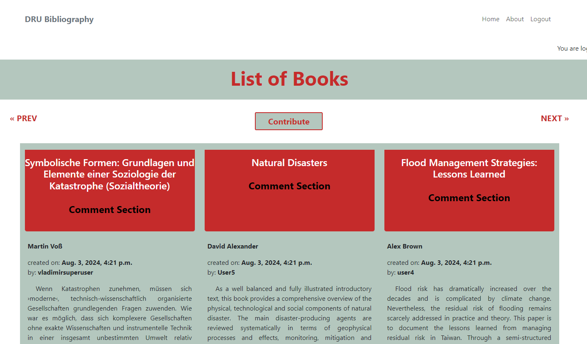
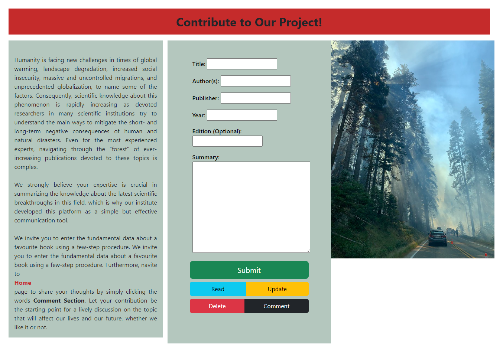
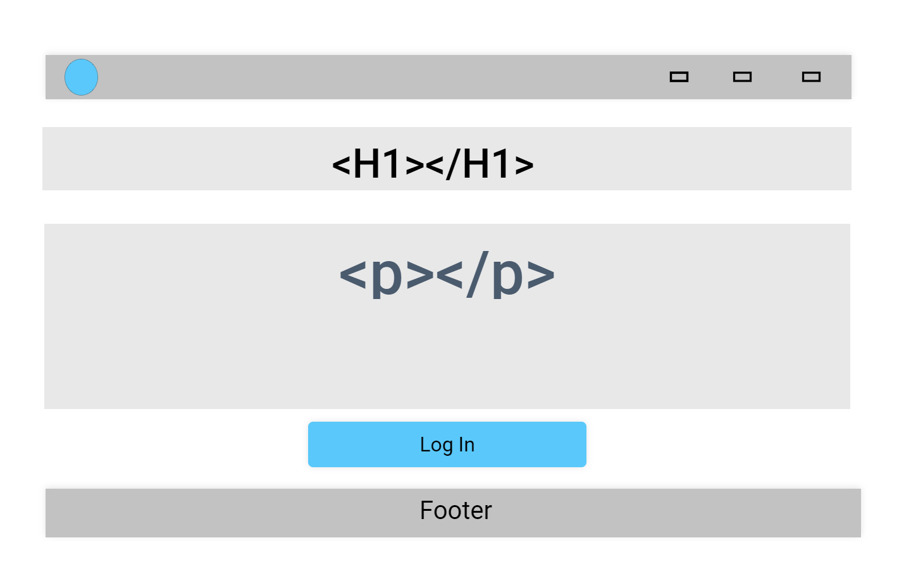
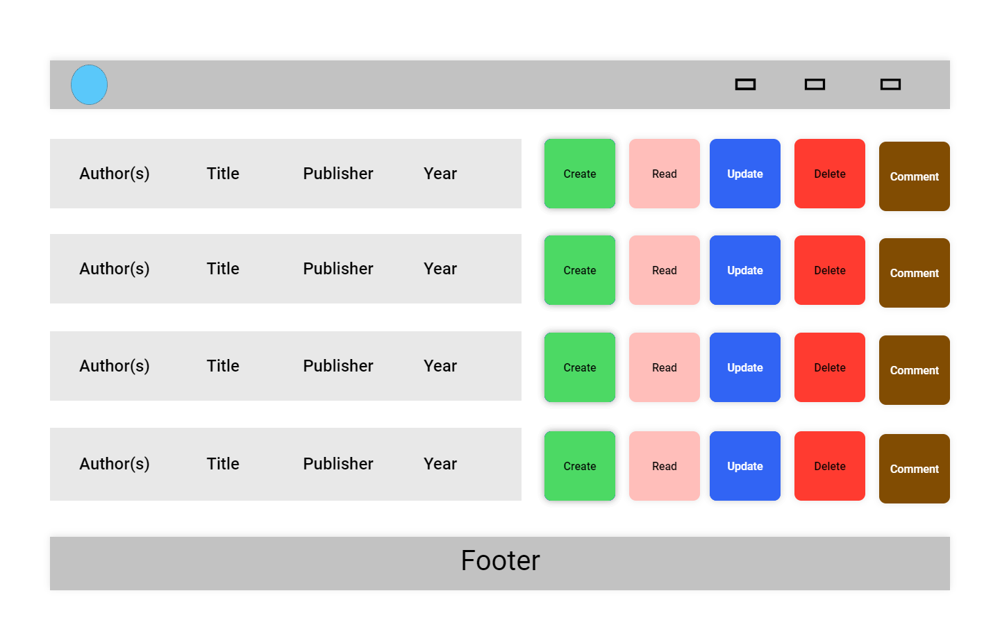

# Book Management and Commenting System - Disaster Research  Unit Bibliography

## Objective

This essential project enables end-users to create, read, update, and delete entries for book titles on specific topics, thereby establishing a unique database. The "review" option is an added important feature, allowing readers to engage in discussions and share their thoughts.

## Users Benefits and Goals

- Product Owner 
    the webssite establishes a powerful tool for knowledge dissemination, networking activities, sharing and acquiring cutting-edge ideas on specific topics

- Final User
    
#### A) For the first-time user
 - dynamic digital platform to contribute to and navigate through the content of book entries 

#### For returning and frequent users

- a reliable source of the latest literature on the specific topic, a place to communicate with colleagues, learn what the scientific community members think on particular issues, or even their books that became part of this project.

## User Experience (UX) Section

### Main Features and Structure  

 **Home Page**

 - The landing area offers an overview of the six titles: title, author, time of entry creation, contributors' identity, and a short resume.
 

 - **About page**
 is divided into three sections:

 - a: short textual explanation about the purpose of the project 
 - b: The form section allows users to enter and submit bibliographical units in the database. Further development: The "Read" and"Update" buttons will be deleted. The "Delete" button will become functional. *Superuser* and the *author of the entry* will be able to delete db-elements, which should cause the deletion of all reviews related to this specific entry. The "Comment" button will be renamed to the "Review" button, becoming a direct link to the review section.  
 - c: Capture featuring a forest fire - Further development: The Contact form, similar to one presented in "I think Therefore I Blog," will be introduced instad of the existing capture to enhance cooperation with the product owner and allow minor corrections of book entries. More attention will be paid to the style of this page.

### Additional Features

#### Navigation
 - *Home page* 1: by clicking on DRU Bibliography in navbar 2: Home link in navbar 3: 
 - *List of book navigation* - Next and Prev button introduced [next Only](static/images/next_only.png); [Prev Next](static/images/prev_next.png); 
[Prev only](static/images/prev_only.png);
- *Contribute* 1: by clicking on the Contribute button on the *Home page* (in the further stages of development, the Contribute link will be added to the navbar)
- *Comment section* by clicking on the words *Comment Section* on *Home page*
- *About page* 1: About link in navbar 2: Contribute button in *Home page*

#### Authentification

All required functions have been incorporated. They are functional and styled, when possible, to improve the UX: 
[Register_Log In](static/images/register_login.png); [Log In](static/images/log_in.png); [Loged In](static/images/loged_in.png); [Sign Up](static/images/sign_up.png); 
[Sign Out](static/images/sign_out.png); [No_Log_No_Review](static/images/unloged_no_comments.png);

#### Displaying Static and User-Generated Images

- please, check *"At Risk: Natural Hazards, People's Vulnerability and Disasters"* detail view: [User-Generated Images](static/images/featured_image.png);

## Design and Development

## Prehistory

- This is a continuation of a similar project in whose development was interrupted due to family circumstances.  
[Book Management and Commenting System](https://github.com/VladaAlek/code_institute_django_pp_4 "Book Management and Commenting System"). At its core are these wireframes: 

**Landing Page**

**Data Management Page**

## CRUD Functionality
 - Create - submitting new bibliographical units [submitting new bibliographical units](./static/images/new_biblio_unit_submitted.png)
 - Read - user can see not only the list of books, but each individual book 
 - Update - user can update individual reviews
 - Delete - user can delete individual reviews. *Delete confirmation modal* is operational: [Delete confirmation modal](./static/images/Delete%20confirmation%20modal.png)

## Technologies Used
 -  *Frontend:* HTML, CSS, JS, Bootstrap
 -  *Backend:* Python, Django, SQL

## Model Design and ERD

#### Bibliography Model

 - initial stage [ERD Bibliography](./static/images/ERD_Book.png)
 - final stage [ERD Bibliography](static/images/ERD_Bibliography_2.png)

#### Review Model

 - initial stage [ERD Review](./static/images/ERD_Review.png)
 - final stage [ERD Review](static/images/ERD_Review_2.png)

#### Accessibility
- testing black/red [webaim.org](https://webaim.org/resources/contrastchecker/?fcolor=000000&bcolor=C52B2B "[webaim.org")
- testing white/red [webaim.org](https://webaim.org/resources/contrastchecker/?fcolor=FFFFFF&bcolor=C52B2B "[webaim.org")

## Software Used

- [Multi-mockup-generator](https://techsini.com/multi-mockup/index.php "Multi-mockup-generator") to create the mockup for responsive pages.

## External Code Source

- navbar in base.html, inspiration from: [Shaun (Net Ninja)](https://github.com/iamshaunjp/bootstrap-5-tutorial/blob/lesson-9/index.html "Shaun (Net Ninja)")
- responsive design in index.html and about.html, inspiration from: [Shaun (Net Ninja)](https://github.com/iamshaunjp/bootstrap-5-tutorial/blob/lesson-7/index.html "Shaun (Net Ninja)")

- footer in base.html, adapted and slightly changed from: [Code Institute](https://github.com/Code-Institute-Solutions/blog/blob/main/08_templates/01_base_template/base.html "Code Institute")

## Learning Resources Used
 - [GeeksforGeeks](https://www.geeksforgeeks.org/how-to-create-equal-height-columns-in-bootstrap/ "GeeksforGeeks") 
 - [StackOverflow](https://stackoverflow.com/questions/33934947/searching-by-username-field-in-django-admin/ "StackOverflow") 

## Deployment

- [ElephantSQL](https://www.elephantsql.com/  "ElephantSQL") to store database
- [Cloudinary](https://cloudinary.com/  "Cloudinary") to store images 

## Acknowledgments

 - Capture origin [Flickr Account of Christine Warner-Morin](https://www.flickr.com/photos/christinehawks/50353850332/in/photolist-2jHADpj-7kmiGy-2jHEru9-2jFJ9Y7-22P5zJg-of6wu8-NaF2Rd-ojVc2X-2hy4jKb-ayQ9Zd-2a3Fsxe-oY5g6v-4Qan5V-9E5p81-2jeowAb-8cnfe4-8cqAej-4wfLyv-8Y56Fj-2jFBPqN-cWFQTo-pNWvyC-9EkDQJ-vRtXnm-2k5qz8h-2mg9aBL-24PzNWS-jLRWD-7Deny4-8s5SFR-6KqwLt-2mtZSi1-DaQDT9-2kbz98Q-2iF8i2J-2jEWWFC-83hwXC-2nx2aAF-EZDYqS-6KuEas-2np5gAz-28Q8YfN-27aL8kh-cpQk6E-oR5RdZ-xxdRFb-6RTSvw-2jwwdXD-8kCBE2-wPXpbo "Flickr Account of Christine Warner-Morin")
 - "Orange Fire logo" origin [Freepik.com](https://www.freepik.com/free-vector/orange-fire-logo_35202562.htm#query=fire%20burn%20logo&position=29&from_view=keyword&track=ais_user&uuid=fb1e3f8f-07cb-4333-b537-b6ca4ad264fd  "Freepik.com")

- super helpful members of the Student Support Team. Roman, Rebecca, Sarah, Thomas, Oisin and Alan, **thank you**!

#### list of used book reviews:
 - https://www.preventionweb.net/files/670_72351.pdf
 - https://www.researchgate.net/publication/227704544_Climate_change_and_the_imagination
 - https://academic.oup.com/book/40836
 - https://nap.nationalacademies.org/catalog/13457/disaster-resilience-a-national-imperative
 - https://www.amazon.de/-/en/David-Alexander/dp/1857280938
 - https://www.routledge.com/Natural-Disasters/Alexander/p/book/9781857280944
 - https://www.amazon.com/Disaster-Research-Multidisciplinary-International-Perspectives/dp/1138051616
 - https://https://www.sciencedirect.com/science/article/pii/S2590061724000279
 - https://www.amazon.de/-/en/Dr-Allen-Beattie/dp/B0CLH4J3SZ
 - https://books.google.de/books/about/El_Ni%C3%B1o_Ready_Nations_and_Disaster_Risk.html?id=O1piEAAAQBAJ&source=kp_book_description&redir_esc=y
 
 
### bugs

 - **Favicon** *not visible* in Firefox: [06/Aug/2024 08:31:59] "GET /4/ HTTP/1.1" 500 352382
Not Found: /favicon.ico. *Visible* in: Edge and Chrome.
 - deleted bibliographic unit still visible in the list [Not Deleted](static/images/Disaster_Reseach.png);
 - Server Error 500 when attempting to open single book view [Server Error 500](static/images/external%20server%20error.png); 
 The possible cause of problem was detected, but the issue was left unaddressed due to the time scarcity: [stackoverflow](https://stackoverflow.com/questions/46021463/heroku-giving-500-error-with-little-information-internal-server-error  "stackoverflow")

### Testing

- [review submitted testing](static/images/review%20submited%20testing.png); [review submited testing success](static/images/review%20submited%20testing%201.png); explanation: extra code added to target the precise success message. The captures show the initial and end stages of development.
- [book submitted testing success](static/images/book%20submited%20testing.png);

##### Validation
- CSS
[CSS Index](static/images/CSS_index.png); [CSS About](static/images/CSS_about.png); [CSS Single View](static/images/CSS%20single%20view.png);
- HTML
[Index](static/images/validation%20index%20.png); [About](static/images/validation%20about.png); [Single View](static/images/validation%20single%20view.png); [Registration](static/images/validation%20register.png); [Create Review](static/images/validation%20review%20creation.png);
- JavaScript JSLint doesn't support all ESJ features, hence minor error reports [Jslint](static/images/jslint.png). When possible, the raised issues addressed - too long text in the comments;
- Python [Pythonium](https://pythonium.net/linter)

### Further improvement
 - use slugs (book's key-words) instead of object's id to improve the site's ranking in search engines.

